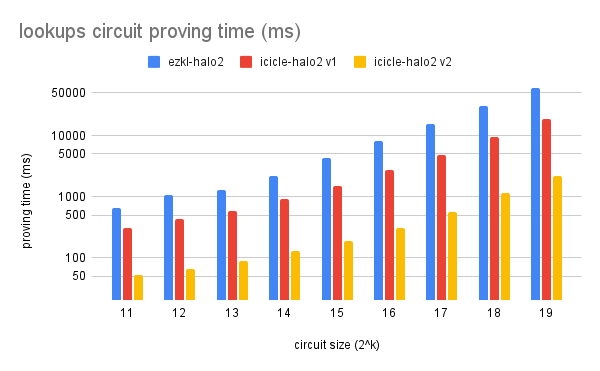
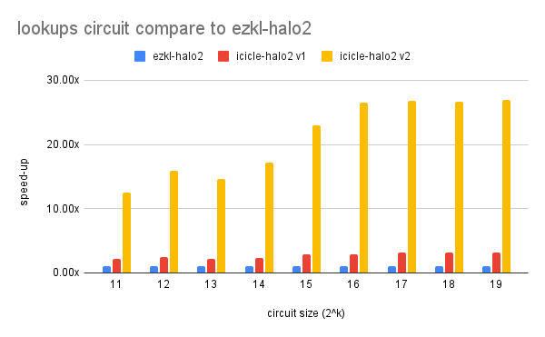
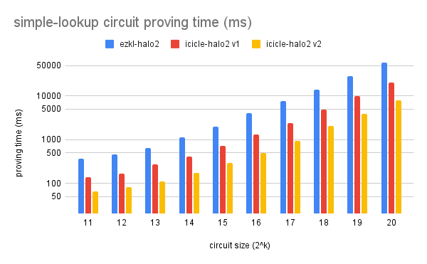
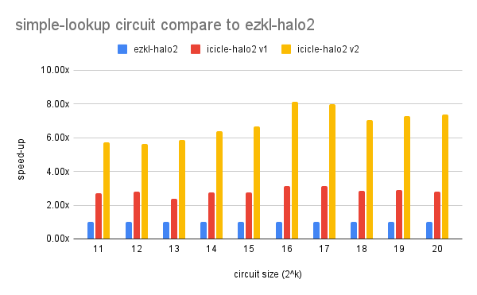
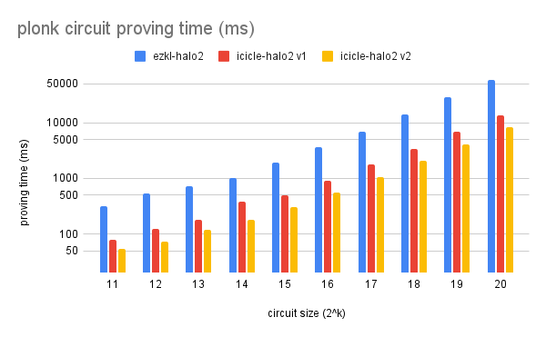
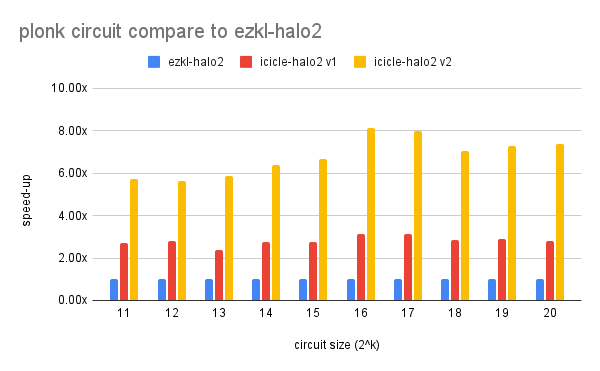

## Icicle Halo2 Usage Guide

This repository contains a ICICLE integration fork of [ezkl-halo2](https://github.com/zkonduit/halo2), designed for efficient proof generation using CUDA.

### Prerequisites

* **Environment Variable Setup**:

  Before running the CUDA backend, set the following environment variable:

  ```bash
  export ICICLE_BACKEND_INSTALL_DIR=halo2/icicle/backend/cuda
  ```

## Benchmarks

We benched the code on this setup:
- 4080 & i9–13900K

We used the circuits in the MoPro’s benchmark repository to compare the proving systems.

- **Simple Lookup**: Defines a lookup table that doubles input values and verifies this relation using both a lookup constraint and a simple identity gate. 
- **Plonk**: Implements a gate that supports both multiplication and addition. It repeatedly computes a^2 + a, verifies correctness using gate constraints.
- **Lookups**:  Defines a lookup-heavy computation using a simple 8-bit lookup table and multiple redundant lookup constraints to inflate the degree of the constraint system.

<p align="center">
  
  
</p>

<p align="center">
  
  
</p>

<p align="center">
  
  
</p>

## Reproducing the benchmarks

We have used the existing benchmark circuits under the halo2 repository. You can reporduce the benchmarks by running 

```bash
cargo run --package halo2_proofs --example lookups
cargo run --package halo2_proofs --example simple-lookup
cargo run --package halo2_proofs --example plonk
```


## License

Licensed under either of

 * Apache License, Version 2.0, ([LICENSE-APACHE](LICENSE-APACHE) or
   http://www.apache.org/licenses/LICENSE-2.0)
 * MIT license ([LICENSE-MIT](LICENSE-MIT) or http://opensource.org/licenses/MIT)

at your option.

### Contribution

Unless you explicitly state otherwise, any contribution intentionally
submitted for inclusion in the work by you, as defined in the Apache-2.0
license, shall be dual licensed as above, without any additional terms or
conditions.
